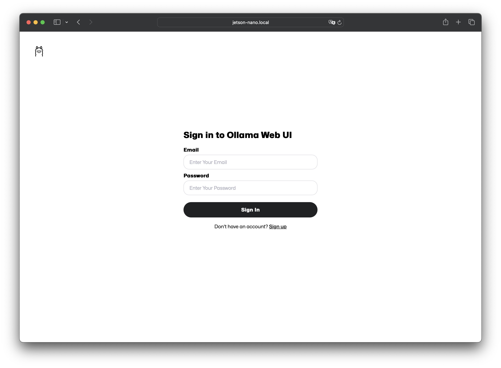
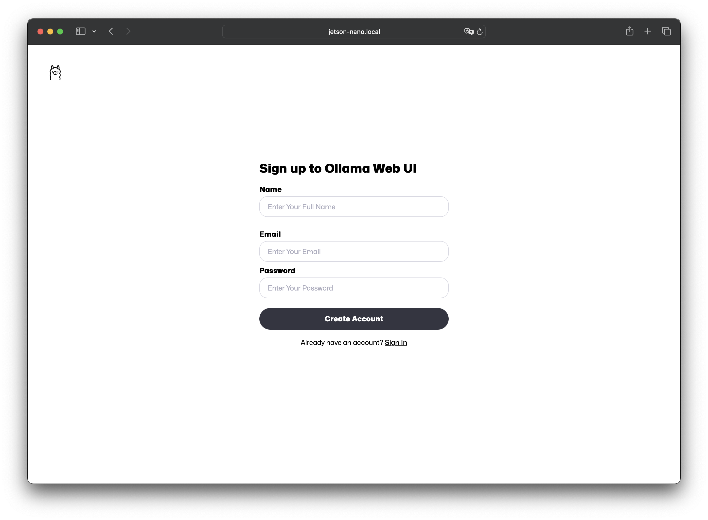
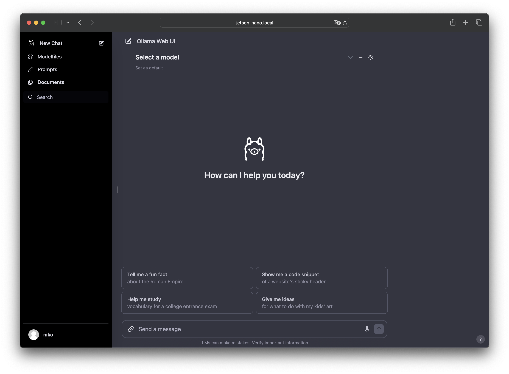
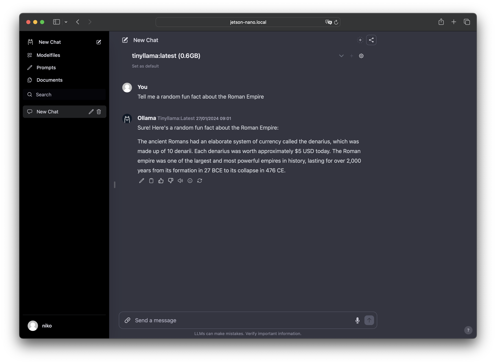

# Edge LLM
## Deploy large language models on low power, single-board computers.

Seamlessly deploy LLMs locally on your Jetson Nano and make use of small models such as [TinyLlama](https://huggingface.co/TinyLlama) and leverage their power using a web-ui.

---

## Quickstart
Run the following command for a quickstart
```zsh
git clone https://github.com/n-vlahovic/edge-llm
cd edge-llm
make init
```
or just
```zsh
make init
```
in case you already cloned and CD'd into the repo.

The WebUI is available under `http://<jetson-ip>:<WEBUI_PORT>` and the LLM backend under `http://<jetson-ip>:<LLM_PORT>`.

## Getting Started

- [Requirements](#requirements)
- [Quickstart](#quickstart)
- [Updating Docker](#updating-docker)
- [Creating an ENV File](#creating-an-env-file)
- [Building the Services](#building-the-services)
- [Pulling Models](#pulling-models)
- [Logging into the Web-UI](#logging-into-the-web-ui)

### Requirements
- NVidia Jetson Nano
- 4GB >= RAM
- 32GB >= Storage (64GB >= preferred)
- JetPack SDK


### Updating Docker
If you installed JetPack following the [official getting-started docs](https://developer.nvidia.com/embedded/learn/get-started-jetson-nano-devkit), it might be that your `docker; docker-compose` version is somewhat dated. 

Running `make docker-update` will update `docker; docker-compose` by invoking the `./scripts/update_docker.py` script, which:
- Checks if the docker version is 
- Removes the existing `docker; docker-compose` installations
- Adds the Docker's official GPG key
- Adds the repository to Apt sources
- Installs the Docker packages
- Enables docker service
- Adds the current `$USER` to the `docker` user group (a reboot will be necessary)


### Creating an ENV File
The `docker-compose.yml` file has abstracted certain parameters by leveraging `.env` files. An `.env` file with the following variables needs to be created:
- `LLM_PORT=<int>`: The exposed port (on the Jetson nano - not the container) of the LLM backend. 
- `WEBUI_PORT=<int>`: The exposed port (on the Jetson nano - not the container) of the LLM WebUI. 

Here is a possible way to create the `.env` file:
```zsh
python3 scripts/check_dotenv.py
```
or
```zsh
echo 'LLM_PORT=8000' >> .env && echo 'WEBUI_PORT=3000' >> .env
```

### Building the Services
To build the services, simply run `make build` which runs `docker compose up --build -d`.

### Stop or Kill
To stop or kill the services, you can run `make <stop|kill>` which runs `docker compose <stop|down -v>`.


### Pulling Models
Our setup uses [Ollama](https://ollama.ai/) as backend, here is a list of [out-of-the-box available models](https://ollama.ai/library).

Models can be pulled as such:
```zsh
python3 scripts/pull_model.py -m <model>
```
alternatively
```zsh
docker exec -it ollama ollama pull <model>
```

Given the compute and memory limitations of our platform, we should aim at deploying small models, e.g. `tinyllama`.


### Logging into the Web-UI
Using any device connected to the same network as your Jetson Nano, navigate to the URL `http://<HOST>:<WEB_UI_PORT>` (the `HOST` can typically be the `hostname` of your Jetson Nano e.g. `jetson-nano.local` or its ip-address which can be determined via `ip a`).

You should be prompted with this login screen. 
If you didn't create an account, create one via the *Sign up* link.  
Please note that this creates a local account. For persistency, the data is saved via `docker volumes` onto the filesystem in the `./ollama-webui` directory (which is excluded from `git`).

Once logged in, this how the UI should look like: 

You can now select a model and start a prompt - enjoy! 
